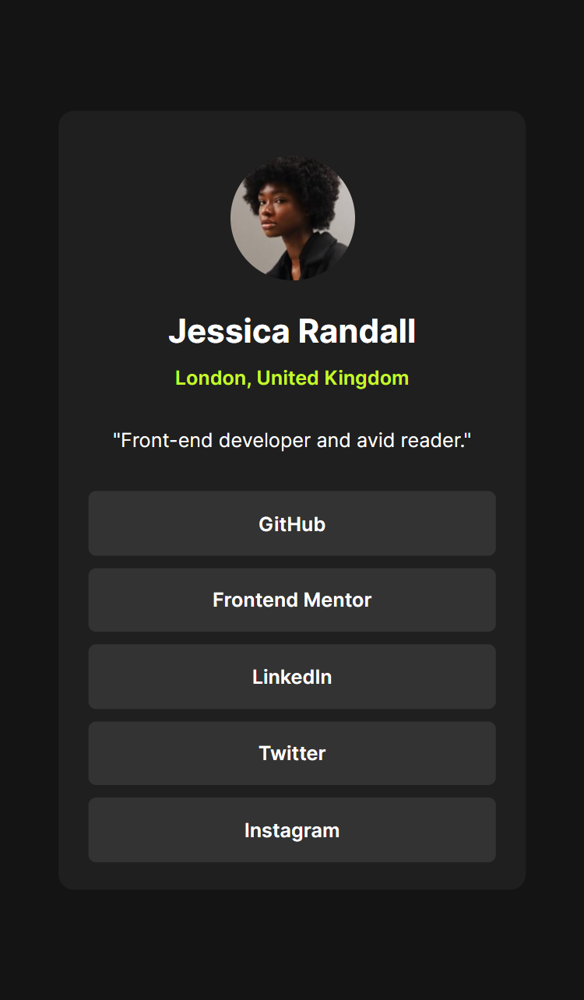

# Frontend Mentor - Social links profile solution

This is a solution to the [Social links profile challenge on Frontend Mentor](https://www.frontendmentor.io/challenges/social-links-profile-UG32l9m6dQ). Frontend Mentor challenges help you improve your coding skills by building realistic projects. 

## Table of contents

- [Overview](#overview)
  - [The challenge](#the-challenge)
  - [Screenshot](#screenshot)
  - [Links](#links)
- [My process](#my-process)
  - [Built with](#built-with)
  - [What I learned](#what-i-learned)
  - [Useful resources](#useful-resources)
- [Author](#author)
- [Acknowledgments](#acknowledgments)

## Overview

### The challenge

Users should be able to:

- See hover and focus states for all interactive elements on the page

### Screenshot

Desktop Mode


Mobile Mode


### Links

- [Solution](https://github.com/WebPioneerPro/frontend-mentor---social-links-profile-solution/tree/main)
- [Live Site](https://webpioneerpro.github.io/frontend-mentor---social-links-profile-solution/)

## My process

### Built with

- Semantic HTML5 markup
- CSS custom properties
- Flexbox
- Mobile-first workflow
- [Google Fonts](https://fonts.google.com/specimen/Martel+Sans) for styling

### What I learned

In this project, I further developed my skills in HTML and CSS, particularly in using Flexbox for layout and managing hover and focus states for interactive elements. I also gained experience in working with CSS variables for efficient color management and font styling using Google Fonts.

```css
/* Example of using CSS variables */
:root {
    --green: hsl(75, 94%, 57%);
    --white: hsl(0, 0%, 100%);
    --grey: hsl(0, 0%, 20%);
    --dark-grey: hsl(0, 0%, 12%);
    --off-black: hsl(0, 0%, 8%);
}
```

### Useful resources

- [MDN Web Docs](https://developer.mozilla.org/en-US/) - An invaluable resource for HTML, CSS, and JavaScript documentation.
- [Frontend Mentor](www.frontendmentor.io) - A great platform for practicing front-end development skills through real-world projects with provided designs.

## Author

- Github - [Prabhanjan Sahu](https://github.com/WebPioneerPro)
- Frontend Mentor - [@WebPioneerPro](https://www.frontendmentor.io/profile/WebPioneerPro)


## Acknowledgments

I'd like to thank Frontend Mentor for providing this challenge, which allowed me to apply and enhance my front-end development skills. Additionally, I appreciate the support from the Frontend Mentor community for their valuable feedback and guidance.
